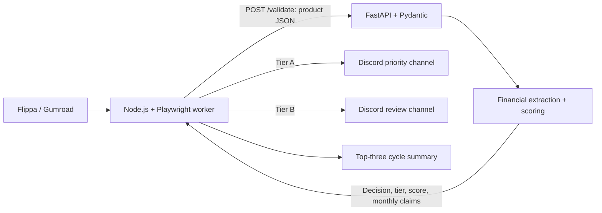

# Opportunity Scout

Opportunity Scout discovers marketplace listings, extracts product and financial claims, scores them against explicit rules, and routes selected opportunities to Discord. It is a two-service engineering project focused on Python API design, browser automation, and reliable service communication.

**Status:** tested portfolio prototype. Offline fixtures demonstrate the full worker → validator path without credentials. Live marketplace coverage and unattended production reliability are not established. This project was formerly named SneakerBot.

## Architecture



- **Worker:** bounded discovery, URL deduplication within each cycle, browser contexts per operation, product extraction, HTTP timeouts and up to three attempts for network/429/5xx failures.
- **Validator:** strict input constraints, hostname-based source detection, pure scoring functions, a stable response model, and a health endpoint. It never fetches the supplied URL.
- **Discord:** the validator's tier is authoritative. A goes to priority, B to review, C is filtered. Summaries sort by score, then descending asking price, preserving the original tie-break behavior. Mentions are disabled.
- **Containers:** separate non-root worker and validator processes on the Compose network. The worker waits for validator health. No validator port is published by default and no Discord secret is passed to the validator.

Stack: Node.js 22+, Playwright/Chromium, discord.js, Python 3.12, FastAPI, Pydantic, Uvicorn, Docker Compose, pytest, Node's built-in test runner, Ruff, GitHub Actions.

## Scoring behavior

The numeric `confidence` API field is a **heuristic score**, not a probability, financial recommendation, or independently verified revenue.

1. Reject prices below $100, non-investable categories (e.g. courses/templates), missing revenue/profit/sales signals, and Gumroad listings without review evidence.
2. Extract explicit monthly USD-style claims in formats such as `Monthly revenue: $1.97K`, `$500 monthly profit`, or `Revenue: $900/month`. Commas, decimals, K and M suffixes are supported. Annual and ambiguous periods are not converted.
3. Apply source base scores, financial evidence bonuses, risk penalties, and business-model keyword boosts. Listings below $200 receive a 40-point penalty.
4. Clamp to 0–100; cap at 70 when no positive monthly revenue/profit was extracted.
5. Tier A requires score ≥93 and revenue ≥$500/month or profit ≥$300/month. Tier B requires score ≥88 when A is not met. All other results are C.

See [scoring.py](validator/scoring.py) and its boundary tests for the complete rule set. These rules intentionally retain the existing project's business focus; they are not a trained model.

## Local setup

Prerequisites: Python 3.12 and Node.js 22 or newer. Run commands from the repository root.

```bash
python -m venv .venv
# macOS/Linux:
source .venv/bin/activate
# Windows PowerShell instead:
# .\.venv\Scripts\Activate.ps1

python -m pip install -r requirements-dev.txt
npm ci --prefix bot
cp .env.example .env
# PowerShell copy equivalent: Copy-Item .env.example .env
```

Start the validator in one terminal:

```bash
python -m uvicorn validator.main:app --host 127.0.0.1 --port 8000
```

Then verify the real HTTP contract from another:

```bash
node scripts/smoke.js
```

Expected result: `Node -> FastAPI HTTP smoke passed: tiers A, B, C`.

For a full offline worker cycle, set these values in the root `.env`:

```dotenv
DRY_RUN=true
RUN_ONCE=true
REQUEST_DELAY_MS=0
FIXTURE_PATH=fixtures/products.json
```

Run `node bot/index.js` from the root. It prints A/B decisions and never logs in to Discord. Fixtures bypass discovery; the actual FastAPI HTTP request still runs.

For live discovery, remove `FIXTURE_PATH`, install Chromium with `node bot/node_modules/playwright/cli.js install chromium`, and run the worker. Linux may require `install --with-deps chromium`. To enable alerts, set `DRY_RUN=false` and supply a Discord bot token and both channel IDs. The bot needs View Channel and Send Messages permissions in those channels. No privileged Discord intents are required.

## Environment

| Variable | Default | Purpose |
| --- | --- | --- |
| `DISCORD_TOKEN` | empty | Required for Discord mode; never logged |
| `CHANNEL_ID_PRIORITY` | empty | Tier A alerts and cycle summaries |
| `CHANNEL_ID_REVIEW` | empty | Tier B alerts |
| `DRY_RUN` | `true` in example/Compose | Disable Discord; raw local code requires explicit `true` |
| `RUN_ONCE` | `false` | Exit after one cycle |
| `VALIDATOR_URL` | `http://127.0.0.1:8000/validate` | Compose overrides with `http://validator:8000/validate` |
| `HTTP_TIMEOUT_MS` | `10000` | Timeout per validator request / Discord REST timeout |
| `CYCLE_INTERVAL_MS` | `600000` | Delay between completed cycles |
| `REQUEST_DELAY_MS` | `2000` | Delay between processed listings |
| `MAX_TARGETS_PER_CYCLE` | `30` | Maximum listings processed per cycle |
| `FIXTURE_PATH` | unset | Local-only product JSON array; requires dry-run mode |

Run the local worker from the root so dotenv finds the root file. Compose reads root `.env` for interpolation and passes only the listed settings. Fixture files are not baked into production images. Boolean settings use the exact string `true`.

## Docker

```bash
docker compose config --quiet
docker compose build
docker compose up -d
docker compose logs -f
docker compose down
```

Compose defaults to dry-run mode but still contacts marketplaces. The Playwright package and image are pinned to matching versions, as required by [Playwright's Docker guidance](https://playwright.dev/docs/docker). The Python image follows the [FastAPI container deployment pattern](https://fastapi.tiangolo.com/deployment/docker/).

The validator listens on port 8000 only inside the Compose network. For local API development, use Uvicorn directly as above. Avoid exposing this unauthenticated internal API publicly. SIGINT/SIGTERM abort the worker loop and close browser and Discord resources.

## API

- `GET /health` → `200 {"status":"ok"}`
- `POST /validate` → HTTP 200 for both approved and business-rule-rejected listings
- Malformed or out-of-range input → HTTP 422, without echoing submitted values
- Local interactive API documentation: [Swagger UI](http://127.0.0.1:8000/docs)

Example request:

```json
{
  "title": "Example SaaS business",
  "price": 850,
  "reviews": 12,
  "description": "Monthly revenue: $1.2K. Monthly profit: $400.",
  "url": "https://flippa.com/12345-example"
}
```

Every decision includes `approved`, `confidence`, `tier`, `source`, `monthly_revenue`, `monthly_profit`, and `reason`. Price must be positive and finite; reviews must be a non-negative integer; title, description, and URL have size limits. URL credentials and extra fields are rejected.

## Tests and checks

```bash
python -m pytest -q
python -m ruff check validator scripts
npm test --prefix bot
npm run check --prefix bot
node bot/node_modules/playwright/cli.js install chromium
npm run test:browser --prefix bot
npm audit --prefix bot
python -m pip_audit -r validator/requirements.txt
python scripts/scan_secrets.py
```

Tests cover financial parsing, approval gates, score/tier boundaries, source spoofing, invalid API inputs, ranking, bounded retries, tier routing, and browser cleanup. A real Chromium test intercepts requests with fixture HTML; it does not contact third-party sites. `scripts/smoke.js` verifies Node-to-FastAPI communication over actual HTTP.

GitHub Actions runs Python and Node tests, static checks, dependency audits, the HTTP integration test, Docker builds, Compose networking, and a container Chromium smoke test. CI requires no Discord credentials. Both jobs passed in the [hardening validation run](https://github.com/JoshkieChan/Opportunity-Scout/actions/runs/37631912367).

## Limitations and project status

- Marketplace selectors, rendering timing, rate limits, login gates, and anti-bot defenses can change. Empty discovery results are possible; site availability is not guaranteed.
- Asking price prefers product metadata, then falls back to the first dollar amount in body text. That fallback may confuse a financial claim with an asking price. Explicit non-USD metadata is rejected, but unlabelled dollar text is assumed USD.
- Financial claims are unverified. Regexes and keyword rules can miss valid listings or accept misleading ones; negative profit is not modeled. Ambiguous values fail conservatively.
- Gumroad products are often licenses rather than transferable businesses; approval does not establish resale or ownership rights.
- Deduplication is per cycle only. There is no persistent alert history or guaranteed delivery; repeat alerts across cycles are possible.
- Python direct dependencies and Node's dependency graph are pinned; Python transitive dependencies are resolved at installation and audited in CI.
- Live Discord delivery, current marketplace discovery, and Hetzner hosting are optional integrations, outside the required portfolio validation scope. They were not exercised during the hardening pass.
- Local tests, API HTTP integration, Chromium fixture extraction, and Compose configuration validation pass. Both Docker images, validator health, worker-to-validator communication over the Compose network, and Chromium inside the worker container also passed in GitHub Actions.

This is a portfolio prototype demonstrating backend and automation engineering, not a production investment screening service. See [the audit record](docs/AUDIT.md) for the changes and validation evidence.
